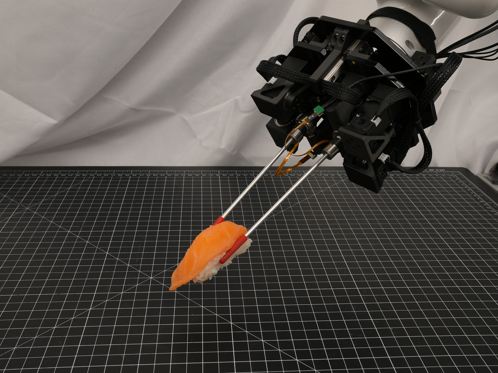

<html lang="en-US">
<head>
  <meta charset="UTF-8">
  <meta name="viewpoint" content="width=device-width, initial-scale=1.0">
  <!--<link rel="stylesheet" href="style.css"> -->
  <title>HASHI: Highly Adaptable Seafood Handling Instrument for Manipulation in Industrial Settings</title>
</head>
<body>
  <div class="header-adder">
    <div class="title_set">
      <h1>HASHI: Highly Adaptable Seafood Handling Instrument for Manipulation in Industrial Settings</h1>
    </div>
    <div class="names">
      <p><strong> Austin Allison <sup>1*</sup><a></a>, <a  href="https://nhanson.io/"  >Nathaniel Hanson<sup>1*</sup></a>, Sebastian Wicke<sup>1</sup>, <a  href="https://www.tpadir.info/">Taşkın Padır<sup>1</sup></a></strong></p>
  </div>

  <div>
    <div style="position:relative;padding-top:56.25%;">
      <iframe src="https://www.youtube.com/embed/36idGZOnESs?si=cUsFvBwUTLQvg5QG"  title="YouTube video player" frameborder="0" allow="accelerometer; autoplay; clipboard-write; encrypted-media; gyroscope; picture-in-picture" allowfullscreen style="position:absolute;top:0;left:0;width:100%;height:100%;"></iframe>
    </div>
  </div>

  </div>
  <h2>Abstract</h2>
  <p>The seafood processing industry provides fertile
ground for robotics to impact the future-of-work from multiple
perspectives including productivity, worker safety, and quality
of work life. The robotics research challenge is the realization of
flexible and reliable manipulation of soft, deformable, slippery,
spiky and scaly objects. In this paper, we propose a novel
robot end effector, called HASHI, that employs chopstick-like
appendages for precise and dexterous manipulation. This gripper
is capable of in-hand manipulation by rotating its two constituent
sticks relative to each other and offers control of objects in all
three axes of rotation by imitating human use of chopsticks.
HASHI delicately positions and orients food through embedded
6-axis force-torque sensors. We derive and validate the kinematic
model for HASHI, as well as demonstrate grip force and torque
readings from the sensorization of each chopstick. We also
evaluate the versatility of HASHI through grasping trials of a
variety of real and simulated food items with varying geometry,
weight, and firmness.
  </p>

∗These authors contributed equally

<div style="text-align: center;">
  <figure>
      
    <figcaption>HASHI holding a piece of salmon nigiri
    </figcaption>
  </figure>
</div>

  <p>
    <a href="https://github.com/RIVeR-Lab/hashi/tree/main">Link to the Github</a>
  </p>
</body>
</html>

### [ArXiv Link](https://arxiv.org/abs/2311.02277)
### Bibtex
  ```
@misc{allison2023hashi,
      title={HASHI: Highly Adaptable Seafood Handling Instrument for Manipulation in Industrial Settings}, 
      author={Austin Allison and Nathaniel Hanson and Sebastian Wicke and Taşkın Padır},
      year={2023},
      eprint={2311.02277},
      archivePrefix={arXiv},
      primaryClass={cs.RO}
}
```

Correspondence: allison [.] a [@] northeastern [.] edu